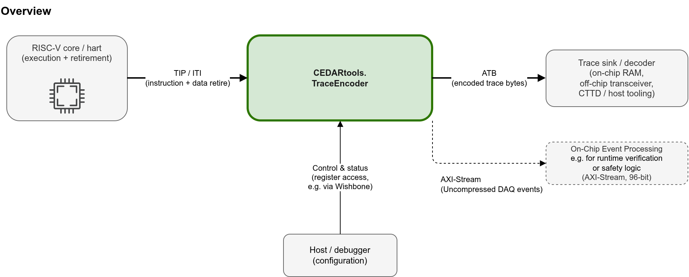

<!--
SPDX-FileCopyrightText: 2026 Accemic Technologies GmbH
SPDX-License-Identifier: CC-BY-4.0
-->

# CEDARtools.TraceEncoder

**Trace encoder IP for RISC-V cores — N-Trace and E-Trace, SystemVerilog,
dual-licensed.**

[](LICENSE.md)
[](https://reuse.software)
[](doc/release-notes.adoc)

> **Naming.** The product name is **CEDARtools.TraceEncoder**, abbreviated
> **CTTE**. The earlier name **C-Trace** is retired from prose but survives
> where renaming would break something outside this repository.

## What is CEDARtools.TraceEncoder?

CEDARtools.TraceEncoder (CTTE) is an open-source hardware implementation of a
[**RISC-V N-Trace encoder**](https://docs.riscv.org/reference/nexus-trace/index.html). It
ingests a core's [instruction-trace port (TIP / ITI)](https://docs.riscv.org/reference/nexus-trace/ntrace_ingress_port.html),
compresses the execution stream into N-Trace messages per the
[IEEE-ISTO 5001-2012 (Nexus) standard](https://github.com/riscv-non-isa/riscv-nexus-trace/blob/main/docs/nexus-standard/IEEE-ISTO-5001-2012-v3.0.1-Nexus-Standard.pdf),
and emits them on an **ATB** (Nexus trace) output, with an additional,
uncompressed **AXI-Stream** event path for on-chip processing. Conformance is
not certified by any official programme; the unimplemented optional messages
and the opt-in extensions that take the stream beyond strict N-Trace 1.0 are
listed in [`doc/trace-format.adoc`](doc/trace-format.adoc#conformance).

A second back end produces [**E-Trace**](https://docs.riscv.org/reference/e-trace/v2.0/index.html)
(*Efficient Trace for RISC-V*) `te_inst` packets from the same internal
event stream. Which back end an encoder gets is a **synthesis parameter**
of that instance (`EN_NTRACE` / `EN_ETRACE`, defaulting to
`CT_EN_NTRACE` / `CT_EN_ETRACE` in
[`rtl/pkg/ct_pkg.sv`](rtl/pkg/ct_pkg.sv); the default is N-Trace only) —
exactly one per encoder, so a multi-encoder SoC can mix protocols in one
netlist and each encoder reports its own in the read-only
`trTeProtocolSel`. Everything ahead of the back end — filtering,
synchronization, data trace, timestamps — is protocol-agnostic and
shared.



The encoder sits between a RISC-V core and a trace sink and 
is configured over a Wishbone CSR bus whose register map follows 
the [RISC-V Trace Control Interface Specification v1.0](https://docs.riscv.org/reference/trace-control-interface/index.html).

See [`doc/architecture.adoc`](doc/architecture.adoc) for the internal
pipeline, the five clock domains, and the top-level IO.

## Features

- **Program trace** — both N-Trace instruction modes, branch history
  (HTM, default) and branch trace (BTM), with Indirect Branch History,
  program-trace correlation, and Resource Full (ICNT / HIST) handling.
- **Bandwidth optimizations** — the N-Trace chapter 9 suite (implicit
  return, sequential jump, repeated history, repeat branch), plus branch
  prediction (512 entries) and a jump-target cache (64 entries).
- **Synchronization** — reset, trace-enable, periodic, explicitly
  requested, and quota-driven cadences that bound the re-anchor distance
  by emitted messages or ATB bytes — what a live/ring consumer such as
  [CEDARtools](https://accemic.com/cedartools/) needs.
- **Data trace** — read / write messages with address, size and value,
  their sync variants, XOR address compression, and a shed-before-stall
  drop policy. Unified or split load/store via `SPLIT_DATA_ACCESS`.
- **Filtering & watchpoints** — address, range and context comparators on
  control and data flow, plus a 1023-slot indirect watchpoint table.
- **Instrumentation** — Data Acquisition messages (payload up to 192 bit)
  driven by ACT-CAP / ACT-ST and routable to the ATB and/or AXIS sinks,
  with per-region performance counters.
- **Timestamping** — absolute on sync, delta otherwise, against a
  free-running wall clock; runtime type, prescale and width.
- **Overflow / overrun recovery** — announced loss plus re-anchor, and a
  FIFO-overrun resync path.
- **Output** — variable-length MDO/MSEO onto a 32-bit ATB port, a 96-bit
  uncompressed AXIS instrumentation port, and an optional packet-aware
  funnel that merges up to four ATB streams.
- **E-Trace back end** — `te_inst` packets per the RISC-V Efficient Trace
  specification, produced from the same internal event stream and framed
  onto the same ATB output. The back end is a **per-instance synthesis
  choice** (`EN_NTRACE` / `EN_ETRACE`, exactly one per encoder; a
  multi-encoder SoC may mix both kinds in one netlist -- `examples/kv260/trio`
  does). `trTeProtocolSel` is read-only discovery of that choice, not a
  run-time switch.
- **Configuration** — CSR interface generated from SystemRDL; the register
  map follows the [RISC-V Trace Control Interface](https://docs.riscv.org/reference/trace-control-interface/index.html)
  (standard `trTeControl` / `trTeImpl` component discovery and component
  types). A **Wishbone** adapter ships by default, but the bus is swappable:
  PeakRDL-regblock natively targets **APB3/APB4**, **AXI4-Lite**,
  **Avalon-MM**, and **OBI** too — regenerate with a different `--cpuif`,
  or wrap the passthrough interface like the bundled Wishbone adapter.
- **Scaling** — RV32 or RV64 address path (`CT_XLEN`; the E-Trace back end
  is RV32 only), and per-feature `CT_EN_*` switches that omit logic *and*
  the registers that would control it.

Data trace, the DAQ / ACT instrumentation, filters, performance counters,
the AXIS port and the funnel are CTTE additions beyond N-Trace 1.0 — the
detail is in [`doc/enhanced-features.adoc`](doc/enhanced-features.adoc);
for the Nexus / N-Trace message formats, see
[`doc/trace-format.adoc`](doc/trace-format.adoc).

## Quickstart

**Prerequisites**

| Tool          | Version  | Purpose                              |
|---------------|----------|--------------------------------------|
| Xilinx Vivado | 2022.1   | Simulation and/or synthesis (via abc)|
| Verilator     | latest   | Simulation (via abc); required for coverage |
| `abc`         | latest   | Project / build driver — see [abc-flow](https://github.com/accemic/abc-flow) |
| PeakRDL       | pinned   | SystemRDL → SystemVerilog (`make rdl`; auto-installed into `.venv-rdl/` from [`rdl/requirements.txt`](rdl/requirements.txt)) |
| Python 3      | ≥ 3.8    | Runs the pinned `make rdl` toolchain |
| GNU Make      | any      | Umbrella commands                    |
| Verible       | latest   | Lint (`make lint`)                   |
| [CTTD](https://github.com/accemic/CTTD) | pinned   | Reference decoder for every decode verdict -- `py scripts/fetch_cttd.py` (`scripts/cttd.pin`) |

Vivado 2022.1 is what the core simulation and gate battery are calibrated
against (`.abc.config`); the KV260 example flows under `examples/kv260/` are
verified with Vivado 2026.1 -- see `examples/README.md`, "Vivado versions".

**Platforms and the `py` command.** The Make/abc flows are written for a
POSIX shell: Linux natively, Windows through Git Bash or MSYS2 (the
Windows-specific handling lives in the `Makefile` and `scripts/ct_env.sh`);
the Python helpers are stdlib-only. Commands in this repository's
documentation are written as `py …` — the Windows Python launcher. On Linux,
read every `py` as `python3`.

**Run the tests**

```sh
make help          # list available targets
make sim           # run all testbenches, print a PASS/FAIL summary
make sim-basic     # run a single testbench (any of the sim-<name> targets)
make sim-examples  # run the examples that have a sim leg (see below)
```

`make sim-examples` runs the examples that are wired into `SIM_EXAMPLES`
(the `SIM_EXAMPLES` variable in the [`Makefile`](Makefile)) — `tgc5b-soc` from
[`examples/kv260/common/tgc5b/`](examples/kv260/common/tgc5b/), plus `ddr-sink-window`,
`axis-wp-shim`, `tgc5b2-axis-soc` and `ctte-smoke` from
[`examples/kv260/`](examples/kv260/) (the shared TGC5B SoC bench, the two unit
benches of the shared sink/shim RTL, the watchpoint testbed's full chain, and
the bare-encoder probe — see
["Simulation legs of the KV260 examples"](examples/kv260/README.md)).
**Open point, now precise:** the MicroBlaze-V-based examples (`mbv`, `duo`,
`trio`) have their benches in the tree since 2026-08-18 but cannot run on the
default backend — they instantiate the Vivado block-design wrapper around the
encrypted MicroBlaze-V core, which has no in-repo source. What a re-user needs
in order to run them under `xsim` is written out in
[`examples/kv260/mbv/sim/README.md`](examples/kv260/mbv/sim/README.md). The
CVA6 and Rocket examples have no bench here at all yet. All of them are
exercised by their board gates (see
[`examples/kv260/README.md`](examples/kv260/README.md)) and by the
hardware-free dashboard demo below.

**See it without hardware.** The fastest way to watch the encoder do real
work is the dashboard's demo mode — stdlib-only Python, no FPGA tools, no
board; it replays committed captures from real runs:

```sh
py examples/dashboard/server.py --demo    # then open http://localhost:8099
```

What the dashboard shows and how its demo captures were recorded is in
[`examples/dashboard/README.md`](examples/dashboard/README.md).

The catalog of worked integrations — what exists, what each one gates, and
the KV260 board flows — is [`examples/README.md`](examples/README.md).
**Building a KV260 demo yourself**, or running a published one without Vivado,
is walked through command by command in
[`examples/kv260/TUTORIAL_build_demos.md`](examples/kv260/TUTORIAL_build_demos.md).

Either simulator can run the testbenches: `abc` drives both Vivado's
`xsim` and Verilator, so only one of the two is required for simulation
(Verilator is additionally needed for `make coverage`).

Simulations run out of the gitignored `bld/` directory. `make sim` drives
each testbench through `abc` and checks the output against the reference
decoder **[CTTD (CEDARtools.TraceDecoder)](https://github.com/accemic/CTTD)**
-- derived from the RISC-V Nexus Trace TG reference decoder NexRv, extended by
Accemic (E-Trace, DAQ, multi-target, CTXP export), and not committed here:
fetch the pinned build with `py scripts/fetch_cttd.py` (pin + sha256 per
platform in `scripts/cttd.pin`, whose `base_url` names where the assets are
published; details in [`bin/README.md`](bin/README.md)). To run one testbench by hand:

```sh
mkdir -p bld && cd bld
abc -sim ../tests/instruction/01_basic/basic_tb.abc
../scripts/decode_and_check.sh --pc --disabled basic_tb
```

> `make sim`, `make lint`, and `make rdl` are real (`make rdl` regenerates
> the register block — see [`rdl/README.md`](rdl/README.md)).

The verification approach (the `cpu_model` stimulus that is also the
answer key, and the decode-and-compare loop) is described in
[`doc/verification.adoc`](doc/verification.adoc).

## Repository layout

```
├── doc/                AsciiDoc documentation
│   └── images/         diagrams (editable .drawio.png — diagram source embedded)
├── rdl/                SystemRDL register definitions (source of truth)
├── rtl/                SystemVerilog RTL sources
│   ├── pkg/            generated CSR SystemVerilog (committed; `make rdl`)
│   ├── adapters/       core-specific TIP ingress adapters (MicroBlaze V, CVA6 ITI, Rocket TCI, ...)
│   └── <module>/test/  per-module testbenches live next to the module
├── tests/              high-level / integration tests (multi-module)
├── formal/             SymbiYosys property gates for the emission core
├── scripts/            developer helpers (RDL gen, lint, decode/check, fetch_cttd, gate checkers)
├── tools/              host tooling (E-Trace te_inst dump/decode/compare, axis_wp_host)
├── verification/       versioned verification data: evidence/ (gate verdicts + utilization reports),
│                       ref_final/ (pinned byte-neutrality reference families), corpus/ (decoder captures)
├── bin/                the FETCHED reference decoder CTTD (gitignored binaries; see bin/README.md)
├── examples/           worked integrations
│   ├── dashboard/      browser demo; replays committed captures without hardware
│   └── kv260/          nine KV260 board examples (mbv, cva6_linux/64, cva6_2, rocket_linux/2, duo, trio,
│                       tgc5b2_axis_wp): fpga/ bitstream flow + fpga/prebuilt/ ready-to-load app,
│                       board/ Bash board drivers, sw/;
│                       common/ shared sinks + the TGC5B core/bridge/RAM library (common/tgc5b/);
│                       common/board/ packaging+deploy+loader; third_party/ pinned reference cores (fetch.sh)
├── third_party/        vendored RISC-V trace-spec reference models
├── .github/workflows/  CI: lint, publication guards, dashboard tests, simulation, REUSE, formal
└── LICENSES/           full text of every license used by this repo
```

## Documentation

Full documentation lives under [`doc/`](doc/):

- **Reference Manual** — the complete CEDARtools.TraceEncoder reference
  (interfaces, register map generated from the SystemRDL sources, message
  catalog, core adapters, demonstrators, verification and conformance),
  shipped as [PDF](doc/rm-ctte.pdf) and as a single self-contained
  [HTML file](doc/rm-ctte.html).
- [Architecture](doc/architecture.adoc) — block diagram, clock domains,
  top-level IO, pipeline stages, register-map overview.
- [Trace format](doc/trace-format.adoc) — Nexus / RISC-V N-Trace
  compliance, message types, MDO/MSEO encoding.
- [Enhanced features](doc/enhanced-features.adoc) — the CTTE-specific
  extensions (DAQ / ACT-CAP, filtering, sync variants, funnel, …).
- [Verification](doc/verification.adoc) — the test harness and checking
  principle.
- [Integration](doc/integration.adoc) — the integrator-facing contract:
  clocks, resets, ingress, control interface, egress, shutdown semantics.
- [Development](doc/development.adoc) — build flow, RDL flow, and SoC
  integration.
- [Ingress adapters](doc/adapters/README.adoc) — the core-specific TIP
  adapters (AMD MicroBlaze-V, CVA6 ITI, Rocket TCI) and the trace semantics
  each one maps.
- [Release notes](doc/release-notes.adoc) — current state and the
  by-design limitations to read before filing a bug.

The formal property gates for the emission core have their own writeup in
[`formal/README.md`](formal/README.md).

## Related repositories

CTTE is one of several public Accemic repositories that work together. The
one it *fetches from* is pinned by version **and** sha256 in `scripts/`, so a
verdict here is always taken against a known build. (The pre-built KV260
demo apps are not fetched at all: every `examples/kv260/<demo>/` carries its
own under `fpga/prebuilt/`, so a demo runs without Vivado straight from the
checkout — see the [build tutorial](examples/kv260/TUTORIAL_build_demos.md).)

| Repository | What it is | How CTTE uses it |
|---|---|---|
| [accemic/CTTD](https://github.com/accemic/CTTD) — CEDARtools.TraceDecoder | the reference decoder: N-Trace and E-Trace, DAQ, multi-target streams, CTXP export; derived from the RISC-V Nexus Trace TG reference code (NexRv) | every decode verdict — fetched, never committed: `scripts/cttd.pin` + `py scripts/fetch_cttd.py` |
| [accemic/CTXP-format](https://github.com/accemic/CTXP-format) | the CTXP trace-export format specification | the value-aware data / DAQ checks compare CTTD's CTXP export against the model |
| [accemic/abc-flow](https://github.com/accemic/abc-flow) | `abc`, the text-file-based project / build / simulation driver | every `make sim-*` target |

## License

CTTE is licensed per artifact type — see [`LICENSE.md`](LICENSE.md)
for the full statement:

- **Hardware IP** (RTL, RDL, constraints, and the SystemVerilog/`.abc`
  testbenches) is dual-licensed under **CERN-OHL-S-2.0** (strongly
  reciprocal) or a **commercial license** from Accemic Technologies GmbH —
  `CERN-OHL-S-2.0 OR LicenseRef-Accemic-Commercial`.
- **Software** (scripts, build, CI, config) is **ISC**.
- **Documentation** (Markdown, AsciiDoc, images) is **CC-BY-4.0**.
- **Third-party IP** — the MINRES TGC5B core vendored for the example SoC
  (`examples/kv260/common/tgc5b/cpu/`) is dual-licensed by **MINRES Technologies
  GmbH** under the same open arm —
  `CERN-OHL-S-2.0 OR LicenseRef-MINRES-Commercial`. A commercial license
  for the core comes from MINRES, not Accemic.

Each file declares its own `SPDX-License-Identifier`; the repository is
[REUSE](https://reuse.software)-compliant. For commercial licensing
inquiries: <sales@accemic.com> (encoder IP) — see
[`LICENSE.md`](LICENSE.md#commercial-licensing) for which license covers
what.

## Trademarks

CEDARtools and Accemic are trademarks of the Accemic Technologies GmbH.

RISC-V, RISC-V International, and the RISC-V logos are trademarks of RISC-V
International. Accemic is not a member of RISC-V International: the mark is
used here only descriptively, to name the architecture and the specifications
this encoder targets.

MicroBlaze, Vivado, Xilinx and Kria are trademarks of Advanced Micro Devices,
Inc. Arm, AMBA, AXI, ATB and CoreSight are trademarks or registered trademarks
of Arm Limited (or its affiliates).

All other product names, logos, and brands are the property of their
respective owners and are used here for identification purposes only; such use
does not imply affiliation with, sponsorship by, or endorsement from their
respective owners. See [`TRADEMARKS.md`](TRADEMARKS.md).

## Contributing

See [`CONTRIBUTING.md`](CONTRIBUTING.md). Contributions require a CLA so
that the project can continue to be offered under both licenses. The
maintainers are listed in [`MAINTAINERS.md`](MAINTAINERS.md); security
issues go the way [`SECURITY.md`](SECURITY.md) describes, not through the
public issue tracker. To cite CTTE, use [`CITATION.cff`](CITATION.cff).

## References

- RISC-V E-Trace (Efficient Trace for RISC-V) specification v2.0 — <https://docs.riscv.org/reference/e-trace/v2.0/index.html>
- RISC-V N-Trace specification — <https://docs.riscv.org/reference/nexus-trace/index.html>
- RISC-V Trace Control Interface Specification v1.0 — <https://docs.riscv.org/reference/trace-control-interface/index.html>
- IEEE-ISTO 5001-2012 (Nexus) standard v3.0.1 — [IEEE-ISTO-5001-2012-v3.0.1-Nexus-Standard.pdf](https://github.com/riscv-non-isa/riscv-nexus-trace/blob/main/docs/nexus-standard/IEEE-ISTO-5001-2012-v3.0.1-Nexus-Standard.pdf)
- REUSE Software (SPDX compliance) — <https://reuse.software>
- CERN Open Hardware Licence v2 — <https://ohwr.org/cernohl>

## Acknowledgment — TRISTAN EU project

This work was developed as part of the TRISTAN project, a European Union research initiative involving 46 partners to advance the RISC-V ecosystem. The TRISTAN project, nr. 101095947 is supported by Chips Joint Undertaking (CHIPS-JU) and its members Austria, Belgium, Bulgaria, Croatia, Cyprus, Czechia, Germany, Denmark, Estonia, Greece, Spain, Finland, France, Hungary, Ireland, Iceland, Italy, Lithuania, Luxembourg, Latvia, Malta, Netherlands, Norway, Poland, Portugal, Romania, Sweden, Slovenia, Slovakia, Turkey. See https://tristan-project.eu/ for more information.
