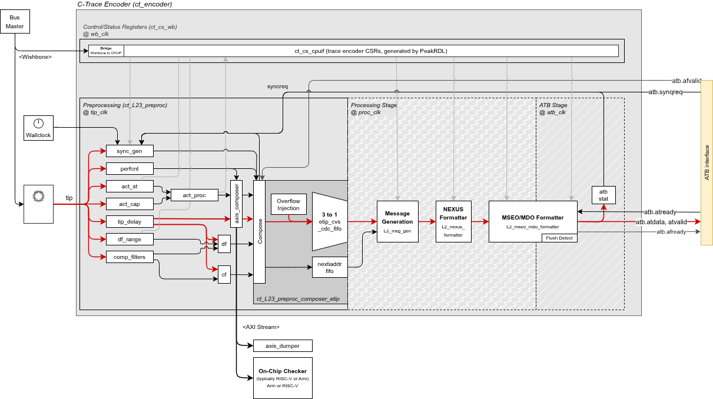

// SPDX-FileCopyrightText: 2026 Accemic Technologies GmbH
// SPDX-License-Identifier: CC-BY-4.0

= Architecture
:toc: macro
:toclevels: 3
:nexus-spec: https://github.com/riscv-non-isa/riscv-nexus-trace/blob/main/docs/nexus-standard/IEEE-ISTO-5001-2012-v3.0.1-Nexus-Standard.pdf

The C-Trace encoder (`ct_encoder`, link:../rtl/ct_encoder.sv[`rtl/ct_encoder.sv`])
turns a RISC-V core's instruction-trace port into a compressed,
{nexus-spec}[NEXUS-IEEE-ISTO-5001-2012-compliant] N-Trace byte stream. This page
describes the top-level module: its block diagram, clock domains,
interfaces, pipeline stages, parameters, and a register-map overview.

The design prioritizes ease of maintenance and extensibility: the
pipeline is built from small, self-contained stages with well-defined
interfaces, so individual blocks can be modified, replaced, or added
without disturbing the rest of the encoder.

toc::[]

== Block diagram

Data flows left to right: the TIP enters in the `tip_clk` domain, the
preprocessor crosses it into the `proc_clk` pipeline, and the MSEO/MDO
formatter crosses again into the `atb_atclk` output domain. The Wishbone
CSR shim (`wb_clk`) configures every stage, and a free-running
`wall_clk` provides the timestamp reference.

== Clock domains

`ct_encoder` spans five clock domains, crossed internally by CDC logic.

[cols="1,3", options="header"]
|===
| Clock | Role

| `tip_clk`    | TIP ingress — the core's retirement rate.
| `proc_clk`   | Internal processing pipeline (msg_gen, formatter).
| `atb_atclk`  | ATB trace output.
| `wb_clk`     | Wishbone CSR access.
| `wall_clk`   | Free-running timestamp reference.
|===

Each domain has its own reset (`tip_rst`, `proc_rst`, `atb_atresetn`,
`wb_rst`, `wall_clk_rst`). An additional `ct_cs_rst` provides a soft
reset of the CSR shim independent of the functional resets.

== Top-level IO

The module is parameterized and connects through SystemVerilog
interfaces:

[source,systemverilog]
----
module ct_encoder #(bit SPLIT_DATA_ACCESS = 0) (
    input  uwire logic tip_clk, tip_rst;  tip_if.slave   tip;    // TIP ingress
    input  uwire logic wb_clk,  wb_rst;   wb_if.slave    wb;     // CSR bus
    input  uwire logic ct_cs_rst;                                // CSR soft reset
    axis_if.master     axis;                                     // instrumentation out
    input  uwire logic atb_atclk, atb_atresetn; atb_if.master atb; // Nexus trace out
    input  uwire logic proc_clk, proc_rst;                       // pipeline clock
    input  uwire logic wall_clk, wall_clk_rst;                   // timestamp clock
);
----

[cols="1,1,3", options="header"]
|===
| Interface | Direction | Carries

| `tip` (`tip_if.slave`)   | in  | Instruction + data retirement from the core: `itype`, `ecause`, `iaddr`, `priv`, `_context`, `iretire`, `ilastsize`; and for data trace `dretire`, `dtype`, `daddr`, `dsize`, `data` (or split-load `sdata` / `lresp` / `ldata`).
| `wb` (`wb_if.slave`)     | in  | Wishbone control/status register access (see <<register-map-overview>>).
| `atb` (`atb_if.master`)  | out | 32-bit ATB Nexus trace stream (`atdata`, `atbytes`, `atvalid`/`atready`, flush handshake).
| `axis` (`axis_if.master`)| out | 96-bit AXI-Stream instrumentation / DAQ export (3 × 32-bit elements).
|===

The TIP field set is defined in link:../rtl/pkg/tip_if.sv[`rtl/pkg/tip_if.sv`].

== Pipeline stages

[cols="1,2", options="header"]
|===
| Stage (module) | Responsibility

| `ct_L23_preproc` +
link:../rtl/ct_L23_preproc.sv[`rtl/ct_L23_preproc.sv`]
| TIP delay, CDC `tip_clk -> proc_clk`, control-/data-flow filtering and
range watchpoints, periodic / trace-enable / quota sync generation,
performance counters, timestamp selection, ACT-CAP / ACT-ST processing,
and composition of the extended-TIP (`etip_q`, `next_iaddr_q`) plus the
AXIS instrumentation output.

| `ct_L2_msg_gen` +
link:../rtl/ct_L2_msg_gen.sv[`rtl/ct_L2_msg_gen.sv`]
| Generates generic trace messages from the eTIP: accumulates ICNT and
branch HIST, emits sync, resource-full (ICNT/HIST overflow) and
trace-off correlation messages. Drives `trace_msg`.

| `ct_L2_nexus_formatter` +
link:../rtl/ct_L2_nexus_formatter.sv[`rtl/ct_L2_nexus_formatter.sv`]
| Maps a generic trace message to a concrete Nexus message — a TCODE plus
an ordered field list (up to `NEXUS_MAX_FIELDS` = 10). Drives `nexus_msg`.

| `ct_L2_mseo_mdo_formatter` +
link:../rtl/ct_L2_mseo_mdo_formatter.sv[`rtl/ct_L2_mseo_mdo_formatter.sv`]
| CDC `proc_clk -> atb_atclk`; serializes the field list into MDO/MSEO
chunks and packs them into 32-bit ATB beats with leading-zero
suppression. Drives the `atb` output.

| `ct_L1_funnel` (optional) +
link:../rtl/ct_L1_funnel.sv[`rtl/ct_L1_funnel.sv`]
| Packet-aware merge of up to four ATB streams into one, without
switching mid-packet. Used when multiple encoders share an output port.
|===

Backpressure flows upstream via per-stage `ready` signals
(`mseo_mdo_formatter_ready -> nexus_formatter -> msg_gen`), and the
formatter reports the emitted byte count back to the preprocessor for
periodic-sync arbitration.

== Parameters and feature switches

[cols="1,3", options="header"]
|===
| Parameter | Effect

| `SPLIT_DATA_ACCESS`
| Selects the data-trace path. `0` = legacy `dretire`-combined mode (data
value on `tip.data` at retirement). `1` = split-load mode: store data on
`tip.sdata`, load data/response on `tip.ldata` / `tip.lresp`.
|===

CSR-controlled feature toggles (instruction vs. data tracing, sync modes,
filter and comparator counts, timestamp source) live in the register map
rather than as build parameters.

[#register-map-overview]
== Register-map overview

The control/status register map is defined in SystemRDL
(link:../rdl/ct_cs_cpuif.rdl[`rdl/ct_cs_cpuif.rdl`], the source of
truth) and accessed through the Wishbone port. It follows the
https://docs.riscv.org/reference/trace-control-interface/index.html[RISC-V
Trace Control Interface] specification: it is organized into components,
each discoverable through a `trXxControl` (active bit) + `trXxImpl`
(version / component type) pair at offsets `0x000` / `0x004`. The Trace
Encoder (`te`, CompType `0x1`) and ATB Bridge (`atb`, CompType `0xE`)
follow the standard component layouts (N-Trace Control Interface Table 4
and Chapter 10); the Performance-Counter, Watchpoint and DF-Filter blocks
are C-Trace **vendor components** (CompType `0x3`/`0x4`/`0x5`) using the
same discovery framework.

NOTE: The CPU interface is generated by PeakRDL-regblock from the same RDL.
C-Trace ships a Wishbone adapter over the passthrough interface, but the
bus is swappable — APB3/APB4, AXI4-Lite, Avalon-MM and OBI are supported
by regenerating with a different `--cpuif`.

[cols="1,1,2,1", options="header"]
|===
| Range | Block | Purpose | CompType

| `0x0000-0x0FFF` | `te`  | Trace Encoder (N-Trace compliant)     | `0x1`
| `0x1000-0x1FFF` | `atb` | Trace ATB Bridge                      | `0xE`
| `0x3000-0x3FFF` | `pc`  | Performance Counters (C-Trace vendor) | `0x3`
| `0x4000-0x4FFF` | `wp`  | Watchpoints / ACT-ST (C-Trace vendor) | `0x4`
| `0x5000-0x7FFF` | `df`  | DF Range Filter (C-Trace vendor)      | `0x5`
|===

Within the Trace Encoder block, the principal registers are
`trTeControl` (`0x000`), `trTeImpl` (`0x004`), `trTeInstFeatures`
(`0x008`), `trTeInstFilters` (`0x00C`), `trTeDataControl` (`0x010`),
`trTeDataFilters` (`0x01C`), the timestamp registers `trTsControl`
(`0x040`) and `trTsCounter{Low,High}`, the `trTeFilter[]` array
(`0x0400`), and the `trTeComp[]` comparator array (`0x0600`).

The ACT-CAP instrumentation command word (`trActCapStCmd`) is a CPU-side
RISC-V CSR at `0x0B10` — it is documented in the RDL for the register
exporter but is **not** decoded on the Wishbone bus; see
link:enhanced-features.adoc[Enhanced features].

=== RISC-V Trace Control Interface compliance

The register map targets the
https://docs.riscv.org/reference/trace-control-interface/index.html[RISC-V
Trace Control Interface (TCI) specification v1.0] (ratified 2024-11-21) —
the companion to the trace *message* format in link:trace-format.adoc[Trace
format]. Every component is self-describing through the spec's two-register
header (`tr??Control` @ `0x000` with the `Active` bit, `tr??Impl` @ `0x004`
carrying `VerMajor`/`VerMinor`/`CompType`). The Trace Encoder
(`CompType 0x1`) and ATB Bridge (`CompType 0xE`) follow the standard
register layouts offset-for-offset — the six mandatory `trTe??` registers,
the optional timestamp unit, and the `trTeFilter[]`/`trTeComp[]` arrays all
match the spec; encoder-local extensions live in the spec's vendor range
(`0xE00-0xFFF`).

The few deviations, all marked `[C-Trace]` in the RDL and none breaking
discovery: the `pc`/`wp`/`df` vendor components use unassigned `CompType`
codes (`0x3`/`0x4`/`0x5`); a handful of `trTeControl` fields
(`SendConfig`, the widened `InstSyncMode`, `InstSyncReq`) and
`trTeDataControl.DataSplitLoad` occupy spec-reserved bits. Unimplemented
optional features (triggers, the `trTeInstFeatures` compression options,
data-trace stall/drop, Ownership/Context emission, the RTL funnel's control
header) read as 0 — the spec-conformant way to advertise an absent option.
