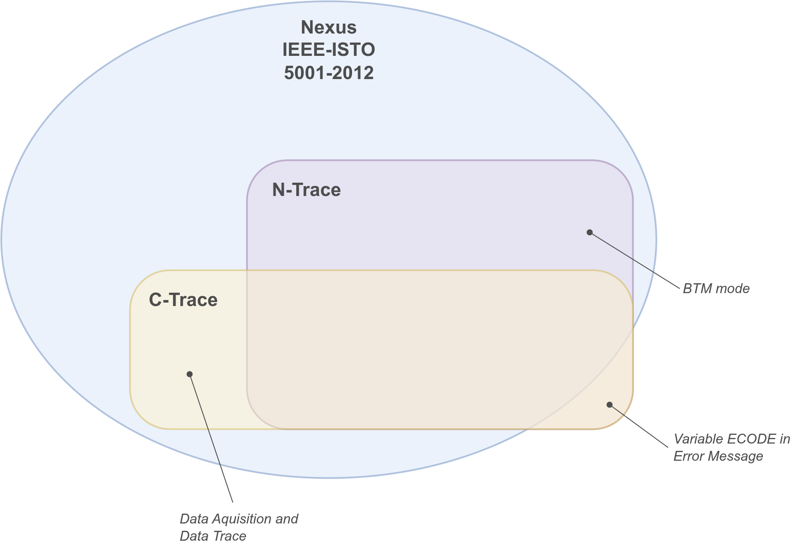

// SPDX-FileCopyrightText: 2026 Accemic Technologies GmbH
// SPDX-License-Identifier: CC-BY-4.0

= Trace format — developed according to the RISC-V N-Trace specification
:toc: macro
:toclevels: 3
:nexus-spec: https://github.com/riscv-non-isa/riscv-nexus-trace/blob/main/docs/nexus-standard/IEEE-ISTO-5001-2012-v3.0.1-Nexus-Standard.pdf

C-Trace emits trace messages following the
https://github.com/riscv-non-isa/riscv-trace-spec[RISC-V N-Trace
specification], which is a RISC-V interpretation of the
{nexus-spec}[**IEEE-ISTO 5001-2012 (Nexus)** standard]. This page summarizes the
message types the encoder produces and the synchronization / resource /
error sub-codes it uses. The
authoritative definitions live in
link:../rtl/pkg/nexus_vendor_riscv_pkg.sv[`rtl/pkg/nexus_vendor_riscv_pkg.sv`].

toc::[]

== Background

A Nexus trace is a sequence of *messages*. Each message starts with a
fixed-width **TCODE** identifying its type, followed by an ordered list
of fixed- and variable-length fields. Messages are serialized onto the
output port as a stream of small chunks using the **MDO** (message data)
and **MSEO** (message start/end/other) encoding, which makes the stream
self-framing and lets the decoder reconstruct field and message
boundaries without a separate length prefix.

RISC-V N-Trace fixes the interpretation of the address and
instruction-count fields for RISC-V, and defines the program-trace,
data-trace and synchronization messages that a compliant encoder emits.

NOTE: This page covers the *encoded* MDO/MSEO trace stream. C-Trace also
provides a separate 96-bit *AXI-Stream* output (`axis_if.master`) that
carries ACT-CAP / DAQ instrumentation independently of the Nexus stream —
intended for on-chip consumers (e.g. a runtime verification) that process
instrumentation data inside the fabric rather than off-chip. See
link:enhanced-features.adoc#axis-output[Enhanced features → Output: AXIS
export and the ATB funnel].

[#where-c-trace-sits]
=== Where C-Trace sits — at a glance

C-Trace targets the *RISC-V N-Trace specification* v1.0 (ratified
2024-11-21), a profile of *IEEE-ISTO 5001-2012 (Nexus)* v3.0.1, and aims
for *strict* interoperability with a stock N-Trace decoder. The matrix
shows how each message and capability is treated by the base Nexus
standard, the N-Trace profile, and the C-Trace implementation; the
<<conformance>> section details only the gaps and deviations.

[%autowidth, cols="3,^1,^1,2", options="header"]
|===
| Capability / message (TCODE) | Nexus | N-Trace | C-Trace

4+s| Program / instruction trace
| Program Trace Synchronization (9)          | ✔ | ✔ (req.) | ✔
| Indirect Branch History (28) — HTM         | ✔ | ✔ (HTM)  | ✔
| Direct / Indirect Branch w/ Sync (11/12)   | ✔ | ✔        | ✔
| Resource Full (27) — ICNT/HIST overflow    | ✔ | ✔        | ✔
| Direct Branch (3) / Indirect Branch (4) — BTM | ✔ | ✔ (BTM) | ○ intentionally omitted (BTM — bandwidth-inefficient)
| Program Trace Correlation (33)             | ✔ | ✔        | ◐ CDF deviation in HTM
| Program Trace Correction (10)              | ✔ | optional | ○

4+s| Program-trace optimizations (bandwidth)
| Implicit return — infer returns from a call/return stack (≤ 32 deep; `InstImplicitReturnMode`) | — | optional (ch. 9) | ○
| Sequential jump — infer `LUI`/`AUIPC`-loaded jump targets (`InstEnSequentialJump`) | — | optional (ch. 9) | ○
| Repeated history — Resource Full RCODE=2 + `HREPEAT` repeat count (`InstEnRepeatedHistory`) | — | optional (ch. 9) | ○
| Virtual-address MSB elision — skip identical address MSBs (`InstExtendAddrMSB`) | — | optional (ch. 9) | ○
| Repeat Branch (30)                         | ✔ | optional | ○
| Repeat Instruction / w/ Sync (31/32)       | ✔ | optional | ○

4+s| Context / system
| Ownership / Context (2)                    | ✔ | ✔ | ○ (planned)
| Device ID (1)                              | ✔ | optional | ○
| Debug Status (0)                           | ✔ | optional | ○

4+s| Data trace (outside the N-Trace program-trace profile)
| Data Trace Read / Write (5/6)              | ✔ | — | ✔
| Data Acquisition (7) — DAQ                 | ✔ (vendor) | — | ✔

4+s| Errors / control
| Error (8) + ECODE (variable-length)        | ✔ | ✔ | ✔
| Vendor Config (56)                         | vendor | — | ○ (planned)

4+s| Encoding / modes
| MDO/MSEO framing                           | ✔ | ✔ | ✔
| Address XOR + LSB-shift compression        | ✔ | ✔ | ✔
| Timestamps                                 | ✔ | ✔ (absolute on sync, delta else) | ✔ (absolute on sync, delta else)
| Message Source (SRC) field                 | ✔ | ✔ | ✔
| Vendor SYNC reasons 12/13                  | Reserved | Reserved | ◐ deviation (see below)
|===

[.small]
✔ defined & implemented conformantly • ◐ partial, unverified, or deviating
(see notes) • ○ defined by the spec but not implemented in C-Trace • —
not defined / not applicable in that spec.

NOTE: The mode names *HTM* and *BTM* are RISC-V N-Trace's; the underlying
methods are pure Nexus. {nexus-spec}[Nexus] §3.3.2 (Branch Trace Messaging) defines two
kinds of branch message — *traditional* (per-branch, = N-Trace BTM) and
*history* (the HIST field + Indirect Branch History messages, TCODE
28/29, = N-Trace HTM) — so both are defined in Nexus too. C-Trace
implements only the history method (HTM); the traditional per-branch
method (BTM) is intentionally omitted because it is bandwidth-inefficient.

== Message types

TCODEs are defined by `nexus_tcode_e`. The categories C-Trace works with:

[cols="1,2,3", options="header"]
|===
| TCODE | Message | Notes

| 3, 4   | Program Trace Direct / Indirect Branch     | Control-flow program trace.
| 9      | Program Trace Synchronization              | Periodic / trace-enable sync; carries SYNC + ICNT + FADDR (+ timestamp).
| 11, 12 | Program Trace Direct / Indirect Branch Sync| Branch message combined with a sync point.
| 27     | Program Trace Resource Full                | ICNT / HIST overflow (see <<resource-codes>>).
| 28, 29 | Indirect Branch History (+ Sync)           | History-mode indirect branch.
| 33     | Program Trace Correlation                  | Emitted on trace-off (EVCODE = Program Trace Disabled) with residual ICNT and pending HIST.
| 5, 6   | Data Trace Write / Read                    | Data-flow trace: DSZ, ELSZ, address, data value (+ timestamp).
| 13, 14 | Data Trace Write / Read Sync               | Data trace combined with a sync point.
| 7      | Data Acquisition                           | Vendor instrumentation (DAQ); IDTAG + up to 192-bit payload.
| 8      | Error                                      | Message loss; ETYPE + ECODE (see <<error-codes>>).
| 56     | Vendor Config                              | Encoder configuration for the decoder.
|===

The concrete field layout per message is built by `get_msg_format()` in
the package. The actively-tabulated formats are Program Trace Sync (9),
Data Trace Write/Read (5/6), Program Trace Correlation (33) and Data
Acquisition (7); the remaining program-trace messages are composed by the
formatter from the same field primitives.

=== Key field widths

[cols="1,1,3", options="header"]
|===
| Parameter | Value | Meaning

| `NEXUS_MSG_ADDRESS_WIDTH` | 32  | Address (FADDR / UADDR) width.
| `NEXUS_MSG_PC_ADDR_SHIFT` | 1   | PC addresses are right-shifted by 1 before encoding.
| `NEXUS_MSG_I_CNT_WIDTH`   | 8   | Instruction-count field width.
| `NEXUS_MSG_HIST_WIDTH`    | 30  | Branch-history field width.
| `NEXUS_MSG_DATA_WIDTH`    | 192 | Data / DAQ payload width (>64 bit for vendor DAQ).
| `NEXUS_MSG_TSTAMP_WIDTH`  | 64  | Timestamp width.
| `NEXUS_MDO_WIDTH`         | 6   | MDO bits per chunk (6/14/30 supported).
| `NEXUS_MAX_FIELDS`        | 10  | Maximum fields per message.
|===

Addresses in PC-carrying fields are transmitted XOR-compressed against a
reference address (`GetUaddr`) and right-shifted by `NEXUS_MSG_PC_ADDR_SHIFT`.

[#sync-reasons]
== Synchronization reasons

The SYNC field of a sync message uses `nexus_sync_reason_e`. C-Trace
implements:

[cols="1,2,3", options="header"]
|===
| Value | Reason | Use

| 2  | `PERIODIC`          | Periodic synchronization (implemented).
| 5  | `TRACE_ENABLE`      | Emitted when tracing is enabled (implemented).
| 7  | `FIFO_OVERRUN`      | Restart marker after a queue overrun.
| 12 | `REQ_CSR`           | [C-Trace] sync requested via CSR.
| 13 | `REQ_ATB`           | [C-Trace] sync requested via APB.
| 14 | `TRACE_QUOTA`       | [C-Trace] sync due to a trace quota limit (# messages / # bytes).
|===

Values 0, 1, 3, 4, 6, 8–11 are defined by the standard (external
trigger, reset/debug/powerdown exit, I-CNT overflow, watchpoint,
contention) and reserved here for completeness.

[#resource-codes]
== Resource codes

The Resource Full message (TCODE 27) uses `nexus_rcode_e`:

[cols="1,2,3", options="header"]
|===
| Value | RCODE | Meaning

| 0 | `ICNT_OVERFLOW`          | Instruction count exceeded the 8-bit field.
| 1 | `HIST_OVERFLOW`         | Branch history filled the HIST field.
| 2 | `HIST_OVERFLOW_REPEATED`| History overflow with pending bits.
|===

[#error-codes]
== Error codes

The Error message (TCODE 8) carries an ETYPE (`nexus_etype_e`:
`QUEUE_OVERRUN` or `HIGH_PRIO` contention) and an 8-bit ECODE bitfield
indicating which message classes were lost:

[cols="1,3", options="header"]
|===
| Bit | Lost message class

| `0x01` | Watchpoint
| `0x02` | Data Trace
| `0x04` | Program (control-flow) Trace
| `0x08` | Ownership Trace
| `0x10` | Status (e.g. Debug Status)
| `0x20` | Data Acquisition (DAQ)
| `0x40` | In-Circuit Trace
| `0x80` | Vendor Defined
|===

The ECODE is transmitted as a variable-length field, so unused high bits
cost no bytes.

[#conformance]
== Nexus / N-Trace conformance

The matrix in <<where-c-trace-sits>> gives the status at a glance; this
section details only the gaps and deviations (the ◐ / ○ rows).

=== Known deviations

[cols="2,2,3,2", options="header"]
|===
| Item | Spec reference | C-Trace behavior | Status

| Vendor SYNC reasons
| Nexus Table 4-13 (12–13 Reserved, 14–15 Vendor)
| `REQ_CSR` = 12 and `REQ_ATB` = 13 use *Reserved* sync codes for vendor
  meaning (`nexus_vendor_riscv_pkg.sv`).
| **Deviation — to fix.** For strict interop these must move to the
  Vendor-Defined range (14/15); a stock decoder sees 12/13 as Reserved.

| Correlation CDF in HTM
| N-Trace Table 24 (HTM: CDF must be 1, HIST always present)
| When no branch history is pending, the encoder emits CDF = 0 and omits
  HIST (`ct_L2_nexus_formatter.sv`); it uses the Nexus-base CDF semantics
  (CDF signals HIST presence).
| **Deviation — to fix.** For strict interop, always emit CDF = 1 + HIST
  in HTM. The bundled NexRv decoder tolerates both forms; a stock decoder
  may not.
|===

=== Not yet implemented

The most significant gap:

* **Ownership / Context message (TCODE 2)** — process/privilege
  correlation (`scontext`/`hcontext`, privilege mode). The control bit
  (`trTeContext`) and the TIP context fields exist, but the message is not
  generated. Needed for OS-aware and multi-hart decode.

Lower-priority optional messages and modes:

* **Indirect Branch History with Sync (29)** — functionally covered by a
  pre-flush Resource Full (HIST) followed by a plain synchronization
  message, rather than the dedicated combined message.
* **Data Trace with Sync (13/14)** and **Program Trace Correction (10)**.
* **Bandwidth optimizations** — none implemented; see the
  _Program-trace optimizations_ rows in the capability table above
  (implicit return, sequential jump, repeated history, virtual-address MSB
  elision, and the Repeat Branch / Repeat Instruction messages). Their
  control fields are stubbed but commented out in `rdl/ct_cs_cpuif.rdl`.

=== Intentionally not implemented

* **BTM mode** — traditional Branch Trace Messaging (Nexus DirectBranch /
  IndirectBranch, TCODE 3/4; N-Trace `ITR_BRANCH`). C-Trace implements
  history mode (HTM) only. Per-branch BTM messaging is bandwidth-inefficient
  — HTM conveys the same control flow at far lower bandwidth — so BTM is
  omitted by design, not pending. The `ITR_BRANCH` encoding is reserved in
  `rdl/ct_cs_cpuif.rdl` and must not be programmed; the encoder emits no
  control-flow message for it.

=== Notes

* **I-CNT field width.** The wire I-CNT field is 8 bits, so long linear
  code emits frequent Resource Full (ICNT_OVERFLOW) messages. This is
  legal (the decoder concatenates) but bandwidth-suboptimal; N-Trace
  notes a wider field (≈ 22 bits) is typical.
