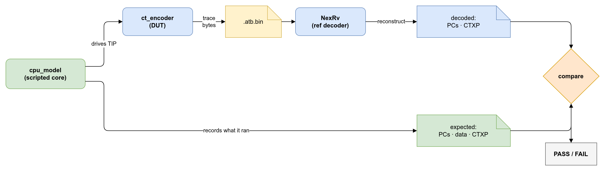

// SPDX-FileCopyrightText: 2026 Accemic Technologies GmbH
// SPDX-License-Identifier: CC-BY-4.0

= Verification — test harness and checking principle

A scripted CPU model is **both the stimulus and the answer key**: it
drives the encoder's instruction input *and* records what it executed.
The encoder turns that into an N-Trace byte stream; an independent
reference decoder (NexRv) turns the bytes back into a trace, which is
compared to what the model recorded. If the encoder mangles the trace,
the reconstruction won't match — and the check fails.

== The loop

NexRv reconstructs two views from the bytes: the **PC stream**
(instruction trace) and the
https://github.com/accemic/C-Trace-eXPort-format[**CTXP**] export —
C-Trace eXPort records for
control flow (`SYNC`, `BRANCH_*`, `CALL`, `RETURN`), memory accesses
(`MEMREAD_n` / `MEMWRITE_n`, with the data value) and instrumentation
(`DAQ_*`). The `cpu_model` emits the matching expected files, and each is
compared.

== Components

[cols="1,2", options="header"]
|===
| Component | Role

| `cpu_model` +
link:../tests/lib/cpu_model.sv[`tests/lib/cpu_model.sv`]
| Task-based scripted core (`run`, `branch_taken`, `load_data`, …) that
is both the stimulus and the reference. The `ct_env` harness wires it
to the DUT and the trace sinks.

| `NexRv` +
link:../bin/NexRv[`bin/NexRv`]
| The RISC-V N-Trace reference decoder, independent of CEDARtools.TraceEncoder. Vendored
as a binary.

| `decode_and_check.sh` +
link:../scripts/decode_and_check.sh[`scripts/decode_and_check.sh`]
| Runs NexRv on the captured `.atb.bin` and compares against the
expected files. Check flags: `--pc` (PC stream), `--ctxp` (CTXP records —
memory accesses *with data values* and DAQ instrumentation), `--data`
(loads/stores, address + size only), `--sync N` (at least N sync
messages), `--disabled` (trace-off correlation message), `--overflow`
(an Error/QueueOverrun message must be present), `--soft` (report
divergence but do not fail).
|===

== Test scenarios

Scenarios live under link:../tests/[`tests/`]; `make sim` runs them all
and prints a per-category PASS/FAIL summary, `make sim-<name>` runs one.

[cols="1,2,2", options="header"]
|===
| Target | Scenario | Focus

| `sim-basic`            | `tests/instruction/01_basic`        | Instruction-trace pause/resume; PC stream + trace-off correlation (TCODE 33).
| `sim-interrupts`       | `tests/instruction/02_interrupts`   | Instruction trace across interrupts/exceptions.
| `sim-stress`           | `tests/instruction/03_stress`       | Dense control flow, HIST overflow, inferable calls/returns; branch-HIST sync-seed regression gate.
| `sim-periodic-sync`    | `tests/instruction/04_periodic_sync`| Periodic sync without HIST loss (pre-flush ResourceFull regression gate).
| `sim-data-basic`       | `tests/data/01_basic`               | Data-trace address, size and data value vs. NexRv CTXP (`--ctxp`).
| `sim-overrun-recovery` | `tests/overflow/01_overrun_recovery`| Full overrun lifecycle: queue-overrun injection, FIFO-overrun resync, soft-reset recovery (`--overflow` is hard).
| `sim-hsi-csr-cap`      | `tests/hsi/01_csr_cap`              | ACT-CAP CSR-driven DAQ; AXIS beat self-check + CTXP DAQ records.
| `sim-combined`         | `tests/combined/01_all`             | Instruction + data + ACT-CAP sync end-to-end.
|===

Known-failing regression gates can be listed in `SIM_XFAIL` in the
link:../Makefile[`Makefile`]: they run and are reported as `XFAIL`
without failing `make sim`, and a surprise pass shows up as `XPASS` (a
signal to promote the test once a fix lands).

NOTE: With both instruction and data tracing on (`sim-combined`), the
data-trace messages flush ahead of the buffered instruction messages, so
CTXP record order is not program order — that scenario checks `--data`
rather than `--ctxp`.

== Coverage

`make coverage` re-runs the whole suite with Verilator line coverage
(`abc --coverage`, gated by the `ABC_COV` make variable) and merges every
test's `coverage_*.dat` into one suite-wide rate via
link:../scripts/coverage_report.sh[`scripts/coverage_report.sh`]. Because
the merge groups coverage points by source file + line, a line exercised by
several testbenches is counted once — the result is the *union* of what the
suite covers, not a per-test average. Plain `make sim` stays uninstrumented
(coverage slows the build), so coverage is an explicit, separate run.

It writes into `bld/coverage/`: `merged.info` (lcov, for `genhtml` or the
VS Code Coverage Gutters extension), an HTML report under `html/`, and
`coverage-badge.json` (a https://shields.io[shields.io] endpoint document)
for the README badge. The suite still runs to completion if a test FAILs,
so the rate reflects whatever data was produced.
