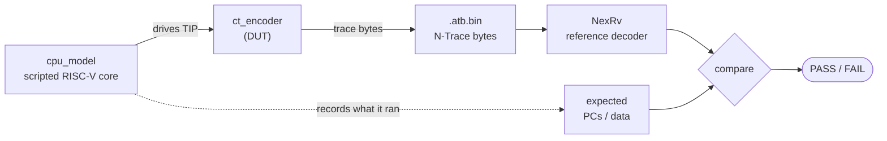

<!--
SPDX-FileCopyrightText: 2026 Accemic Technologies GmbH
SPDX-License-Identifier: CERN-OHL-S-2.0 OR LicenseRef-Accemic-Commercial
-->

# Verification — test harness in a nutshell

A scripted CPU model is **both the stimulus and the answer key**: it drives
the encoder's instruction input *and* records what it executed. The encoder
turns that into an N-Trace byte stream; an independent reference decoder
(NexRv) turns the bytes back into a trace, which is compared to what the
model recorded. If the encoder mangles the trace, the reconstruction won't
match — and the check fails.

- **Stimulus & reference** — `cpu_model` ([`tests/lib/cpu_model.sv`](../tests/lib/cpu_model.sv)): task-based scripted core (`run`, `branch_taken`, `load_data`, …); the harness `ctrace_env` wires it to the DUT.
- **Decoder** — [`bin/NexRv`](../bin/NexRv): the RISC-V N-Trace reference decoder, independent of C-Trace.
- **Check** — [`scripts/decode_and_check.sh`](../scripts/decode_and_check.sh): `--pc` (PC stream), `--data` (loads/stores), `--sync N`, `--disabled` (trace-off message).

Run `make sim` (all tests + a per-category PASS/FAIL summary) or `make sim-<name>` (one). Scenarios live under [`tests/`](../tests/).
