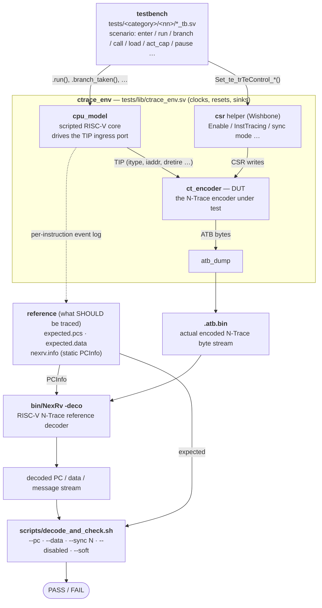

<!--
SPDX-FileCopyrightText: 2026 Accemic Technologies GmbH
SPDX-License-Identifier: CERN-OHL-S-2.0 OR LicenseRef-Accemic-Commercial
-->

# Verification — test system & checking principle

This document explains **how C-Trace is tested**: the simulation
environment, where the stimulus comes from, and how the encoder's output
is checked. The one idea to take away is at the top; the details follow.

## The core idea

> **One model is both the stimulus and the answer key.**
> A scripted CPU model (`cpu_model`) drives the encoder's instruction
> ingress *and* records what it did. The encoder turns that into an
> N-Trace byte stream. An **independent** reference decoder (NexRv) turns
> the byte stream back into a program/data trace, which is compared to
> what the model recorded. If the encoder mangles the trace, the decode
> won't reconstruct the model's program — and the check fails.

So there is a loop: **model → encoder → trace bytes → decoder → compare back to model**.
The encoder is the only unknown in that loop; the model and the decoder
are trusted references on either side of it.

## Big picture



The same flow as a plain block diagram (for editors that don't render
Mermaid):

```
   testbench  tests/<category>/<nn>/<name>_tb.sv
   (the scenario: a sequence of cpu_model tasks + CSR programming)
        │  drives                         │ programs
        ▼                                 ▼
 ┌───────────────────────── ctrace_env (tests/lib) ──────────────────────────┐
 │                                                                            │
 │   cpu_model ───── TIP ingress ─────▶  ct_encoder  ───ATB bytes──▶ atb_dump │
 │      │  (scripted RISC-V core)         (DUT)                         │     │
 │      │                          ▲                                    │     │
 │      │     csr (Wishbone) ──────┘  Enable / InstTracing / …          │     │
 │      │                                                               │     │
 └──────┼───────────────────────────────────────────────────────────── │ ────┘
        │ per-instruction event log                                     │
        ▼                                                               ▼
  expected.pcs                                                      .atb.bin
  expected.data        ┌──── nexrv.info (PCInfo) ───┐           (actual trace)
  nexrv.info ──────────┘                            ▼                  │
        │                              bin/NexRv -deco  ◀──────────────┘
        │ expected                  (reference N-Trace decoder)
        │                                          │ decoded PC / data / msgs
        ▼                                          ▼
        └────────────▶  scripts/decode_and_check.sh  ◀────────────
                          compares expected ⟷ decoded
                          --pc --data --sync N --disabled
                                       │
                                       ▼
                                   PASS / FAIL
```

## The pieces

| Piece | File | Role |
|-------|------|------|
| **testbench** | `tests/<category>/<nn>/<name>_tb.sv` | The scenario. Instantiates `ctrace_env`, programs the CSRs, and drives the `cpu_model` through a sequence of tasks. One directory per test; numeric prefixes order them simple → complex. |
| **ctrace_env** | [`tests/lib/ctrace_env.sv`](../tests/lib/ctrace_env.sv) | The harness. Generates the five clock domains + resets, instantiates the DUT, and wires in the model, the CSR helper, an ATB stall-injector + always-ready sink, and the dumpers. Exposes `cpu`, `csr`, `atb_force_flush`, `atb_bytes_seen`, … |
| **cpu_model** | [`tests/lib/cpu_model.sv`](../tests/lib/cpu_model.sv) | Scripted RISC-V core. Each task (`enter`, `run`, `branch_taken`, `call_to`, `ret`, `uninferable_jump`, `load_data`, `store_data`, `act_cap_cmd`, …) **(a)** drives the TIP ingress port with the right `itype`/`iaddr`/`dretire`/… and **(b)** appends a high-level event to its log. At end of sim it writes the reference files. |
| **ct_encoder (DUT)** | [`rtl/ct_encoder.sv`](../rtl/ct_encoder.sv) | The thing under test — the N-Trace encoder. Consumes TIP, produces the ATB byte stream (and an AXIS side-channel). |
| **atb_dump** | `tests/lib` (amba/test) | Captures the encoder's ATB output to `<name>.atb.bin` — the **primary artifact** of every test (the real N-Trace byte stream). |
| **reference files** | written by `cpu_model` | `<name>.expected.pcs` (executed PCs, traced only), `<name>.expected.data` (load/store sequence), `<name>.nexrv.info` (static PCInfo the decoder needs to walk the program). |
| **NexRv** | [`bin/NexRv`](../bin/NexRv) | External RISC-V N-Trace **reference decoder**. `NexRv -deco <atb.bin> -pcinfo <nexrv.info> -full` reconstructs the PC stream and per-message detail from the encoded bytes. Independent of C-Trace. |
| **decode_and_check.sh** | [`scripts/decode_and_check.sh`](../scripts/decode_and_check.sh) | Runs NexRv once, then compares its output to the reference files. |

## What gets checked

`scripts/decode_and_check.sh [--soft] [--pc] [--data] [--sync N] [--disabled] <test>`
decodes the ATB **once** and runs whichever checks the test needs:

| Flag | Check |
|------|-------|
| `--pc` | Decoded PC stream matches `expected.pcs` (the executed, *traced* PCs). Prefix-tolerant: a matching prefix that is shorter only because of an undrained tail is a `PARTIAL PASS`. |
| `--data` | Decoded `DataRead`/`DataWrite` sequence matches `expected.data`. |
| `--sync N` | At least `N` synchronization messages are present (e.g. startup sync + a requested `CF_SYNC`). |
| `--disabled` | A trace-off **Program Trace Correlation Message** (TCODE 33, EVCODE = *Program Trace Disabled*) is emitted when instruction tracing is turned off. |
| `--soft` | PC/data divergence is reported as `WARN`, not a failure — for tests that intentionally lose bytes (overflow). |

The script exits non-zero iff a requested (non-soft) check fails.

## Why the model is the answer key (and there's no real core)

The `cpu_model` tasks **are** the program: there is no compiled binary
and no instruction memory. Each task drives the TIP exactly as a real
core's retirement would, and logs the same event. The encoder must agree
with that log — that agreement *is* the test. This keeps tests readable
("this exact branch sequence, then this load") and fast (seconds, fully
deterministic), and lets us author precise edge cases. A real-core
integration example is a separate, nightly concern (see
[integration.md](integration.md)), not the per-PR gate.

## Practical notes the tests rely on

- **Trace-off must be flushed.** N-Trace is differential — a message's
  instructions are only resolved by the *next* message. When tracing is
  disabled the encoder emits a Program Trace Correlation Message carrying
  the residual ICNT/HIST so the decoder can walk out the final
  instructions; without it the last few PCs are never delivered (a
  `PARTIAL PASS` tail). See [theory-of-operation.md](theory-of-operation.md).
- **Disable on a quiet boundary.** Instruction tracing is gated by
  `Enable && InstTracing`; the gate acts on the (CDC'd) control signal,
  so a testbench drains a few cycles and disables after a non-control-flow
  instruction. Disabling right after an indirect branch would strand that
  branch's unresolved target.
- **Pause/resume.** Turning `InstTracing` off mid-stream pauses tracing
  (the CPU keeps running, untraced); turning it back on emits a
  `TRACE_ENABLE` sync that re-anchors the decoder. The model's
  `set_inst_traced()` flag keeps untraced instructions out of the
  reference. See `tests/instruction/01_basic`.

## Running it

```sh
make sim            # all tests + a per-category PASS/FAIL summary
make sim-basic      # one test (target nick); see the Makefile for the list
```

`make sim` runs every test even if one fails and prints a summary keyed
to the source tree:

```
======================= make sim summary =======================
  tests/instruction/
    PASS  01_basic
    PASS  02_interrupts
    …
  tests/combined/
    PASS  01_all
================================================================
  RESULT: PASS — all 9 tests passed
```

It exits non-zero iff any test failed (the `RESULT: FAIL` line names the
failing `tests/` paths).

## Where things live

- Test scenarios: `tests/<category>/<nn>_<name>/` — categories are
  `instruction/`, `data/`, `hsi/`, `overflow/`, `combined/`. See
  [`tests/README.md`](../tests/README.md).
- Shared infrastructure: [`tests/lib/`](../tests/lib/) (and its
  [`README.md`](../tests/lib/README.md)).
- Reference decoder + checks: [`bin/NexRv`](../bin/NexRv),
  [`scripts/decode_and_check.sh`](../scripts/decode_and_check.sh).
