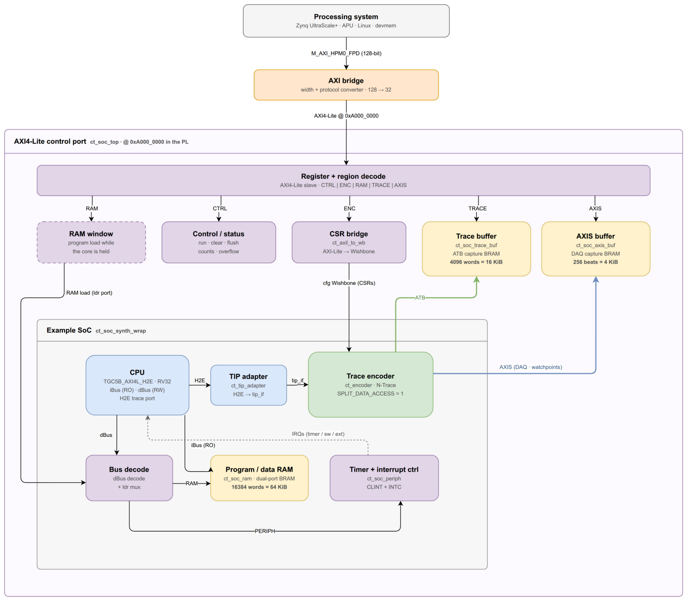

<!--
SPDX-FileCopyrightText: 2026 Accemic Technologies GmbH
SPDX-License-Identifier: CC-BY-4.0
-->

# TGC5B + CEDARtools.TraceEncoder example SoC

A small, self-contained system that shows how to drive the CEDARtools.TraceEncoder N-Trace
encoder from a **real** RISC-V core — as opposed to the synthetic `cpu_model`
stimulus used by the unit tests. It wires the MINRES **TGC5B** (RV32I) core to
`ct_encoder`, adds the minimum a core needs (program/data RAM, a timer, an
interrupt controller), runs a small program, and checks the encoded trace with
the NexRv reference decoder.

The example runs two ways: fully in **simulation** (`sim.sh`, Verilator via
`abc`), and on **hardware** as a loadable app for the Kria **KV260** — driven
entirely from Linux with `devmem`: load a program, configure and enable
CEDARtools.TraceEncoder, start the core, and read the captured trace back, no custom driver.

## Architecture



Three nested tops, one per integration level:

- **`rtl/ct_soc_synth_wrap`** — the bare SoC (inner box): TGC5B core, RAM,
  CLINT + INTC, and the encoder fed from the core's H2E trace port through
  `ct_tip_adapter`, emitting Nexus trace on ATB. The system testbench and the
  OOC synthesis target instantiate this directly.
- **`ct_soc_top`** — the control port around it (middle box): one AXI4-Lite
  slave for the control/status registers, the program load path, the encoder
  CSRs, and the two capture BRAMs (16 KiB ATB, 4 KiB AXIS/DAQ) read back over
  the same port. This is what a host drives — the Zynq PS on hardware, the
  devmem-flow testbench in simulation.
- **`fpga/kv260/ct_soc_kv260_top`** — the bitstream top: the Zynq PS reaches
  the SoC over `M_AXI_HPM0_FPD` through width/protocol converters, based at
  **`0xA000_0000`**. Plain SV, no block design — the PS and AXI IPs are
  standalone XCIs from [`fpga/kv260/gen_ip.tcl`](fpga/kv260/gen_ip.tcl).

The memory map the CPU's dBus sees is authored in
[`rdl/ct_soc.rdl`](rdl/ct_soc.rdl) (SystemRDL, single source — the encoder
CSRs are a real instance of [`rdl/ct_cs_cpuif.rdl`](../../rdl/ct_cs_cpuif.rdl)):

| Base | Region |
|------|--------|
| `0x0000_0000` | RAM (program + data), 16384 words = 64 KiB |
| `0x1000_0000` | PERIPH — CLINT (`mtimecmp`, `msip`, `mtime`) + INTC (`trigger`, `enable`) |
| `0x2000_0000` | ENCODER — CEDARtools.TraceEncoder CSRs (via the Wishbone bridge) |

`make rdl-html` renders the browsable HTML register reference into
`bld/rdl-html/`, including the KV260 app view with the absolute physical
address of every register (encoder CSRs included).

## Files

| File | Role |
|------|------|
| `ct_soc_top.sv` | **Top of the Kria app**: wraps `rtl/ct_soc_synth_wrap` behind one AXI4-Lite control port (program loader, control/status registers, trace-capture readout) |
| `sim.sh` | Trace-an-ELF driver: converts, simulates, decodes, prints the PC stream |
| `rtl/ct_soc_synth_wrap.sv` | The bare SoC: core + adapter + encoder + RAM + peripherals + dBus decode |
| `rtl/ct_tip_adapter.sv` | Maps the core's flat H2E trace port onto the encoder `tip_if` |
| `rtl/ct_axil_to_wb.sv` | AXI4-Lite → Wishbone B4 bridge for the encoder CSRs |
| `rtl/ct_soc_ram.sv` | Dual-port AXI4-Lite program/data RAM (`$readmemh`) |
| `rtl/ct_soc_periph.sv` | CLINT (timer + SW irq) + INTC around the RDL-generated register block |
| `rtl/ct_soc_trace_buf.sv` | ATB capture BRAM used by `ct_soc_top` — 4096 words = 16 KiB (`TRACE_DEPTH`) |
| `rtl/ct_soc_axis_buf.sv` | AXIS instrumentation-capture BRAM (ACT-CAP/ACT-ST DAQ stream) used by `ct_soc_top` — 256 beats × 4 words = 4 KiB (`AXIS_DEPTH`) |
| `rtl/ct_soc_synth_wrap_kv260.xdc` | Kria KV260 (xck26) out-of-context constraints |
| `fpga/kv260/` | Board glue: bitstream flow (`ct_soc_kv260.abc`, `gen_ip.tcl`, `ct_soc_kv260_top.sv`), device-tree overlay, `create_bitfile.sh`, `board_trace.sh`, devmem-flow testbench |
| `cpu/TGC5B_AXI4L_H2E.sv` | Vendored MINRES TGC5B core (third-party IP, licensed by MINRES — see [`cpu/README.md`](cpu/README.md) and **Licensing**) |
| `pkg/ct_soc_regs*.sv` | **Generated** from `rdl/ct_soc.rdl` by `make rdl-soc` (do not edit) |
| `prog/` | Prebuilt `hello_trace` program (`.hex` + NexRv `.pcinfo`) and its source |
| `test/ct_soc_tb.sv` | System testbench: loads the program, runs the core, dumps + checks the trace |

## Running the simulation

```sh
make sim-tgc5b-soc
```

This runs the whole SoC under Verilator (via `abc`): the core executes
`hello_trace`, the encoder produces a Nexus/ATB stream (captured to
`ct_soc_tb.atb.bin`), and NexRv decodes it. The core's own uncompressed golden
trace port (`core_trace_pc`) is captured as the PC reference.

The build regenerates nothing; the program image and `pcinfo` are committed
under `prog/`. Rebuild them (needs a `riscv32-unknown-elf-*` toolchain) with:

```sh
examples/tgc5b_soc/prog/src/build.sh
```

## Tracing your own program

`sim.sh` is the "point it at an ELF and dump the trace" driver:

```sh
examples/tgc5b_soc/sim.sh path/to/your.elf   # trace your own program
examples/tgc5b_soc/sim.sh                     # trace the committed hello_trace
```

It converts the ELF to a memory image + NexRv `pcinfo`, runs the SoC, decodes
the captured ATB stream, and prints a summary plus the reconstructed PC stream
(with instruction types: `L`inear / `C`all / `R`eturn / `B`ranch / `J`ump).

`hello_trace` deliberately covers one of each trace primitive: linear code,
call/return (with a stack frame), taken and not-taken branches, loads/stores,
and two asynchronous traps so the trace also exercises the `INTERRUPT` itype
and the `mret` interrupt-return — a **machine software interrupt** (raised via
the CLINT `msip` register) and a **machine timer interrupt** (`mtimecmp` armed
a few thousand ticks ahead) whose handler calls a function purely "after some
time". A single C trap handler dispatches on `mcause`.

The program is traced **unmodified** — the host acts as the debug host and
turns CEDARtools.TraceEncoder on over the SoC config port before the core starts, so your
program needs no CEDARtools.TraceEncoder CSR writes. Requirements on the ELF: bare-metal
**RV32I** (`+Zicsr` if it uses CSRs / interrupts; no compressed instructions),
**linked at `0x0`** (the reset vector), and small enough for the RAM (64 KiB by
default; raise `MEM_WORDS`). Compile against the reference startup stub and
linker script from `prog/src/`:

```sh
riscv32-unknown-elf-gcc -march=rv32i_zicsr -mabi=ilp32 \
    -nostdlib -nostartfiles -ffreestanding -O1 \
    -Wl,--no-warn-rwx-segments \
    -T examples/tgc5b_soc/prog/src/prog.ld \
    -o my_app.elf examples/tgc5b_soc/prog/src/crt0.S my_app.c
```

`crt0.S` sets up the stack, calls `main()` and parks in the halt loop the
testbench detects; `prog/src/main.c` is the reference for CSR setup and a
machine trap handler. Then `sim.sh my_app.elf` (simulation) or
`fpga/kv260/board_trace.sh my_app.elf` (hardware).

## Enabling and configuring trace

CEDARtools.TraceEncoder is configured entirely through the encoder's CSRs (the ENC region);
the traced program needs no CEDARtools.TraceEncoder awareness. The register map follows the
RISC-V N-Trace control interface and is authored in
[`rdl/ct_cs_cpuif.rdl`](../../rdl/ct_cs_cpuif.rdl) — the definitive reference
for every field. `make rdl-html` renders it browsable (with the absolute
KV260 `devmem` address of each register).

Everything switches on one register, `trTeControl` at `ENC + 0x0`. The words
this example uses:

| Word | Effect |
|------|--------|
| `0x01068067` | enable — `Active`, `Enable`, `InstTracing` set, reset defaults kept |
| `0x01068063` | disable instruction tracing (clean trace-off correlation point) |

**Careful with full-word `trTeControl` writes** — they must preserve the
reset-default fields (`InstMode=6`, `InhibitSrc=1`, `Format=1`).
`InstMode=0` silently drops every control-flow message (the trace still
decodes, but indirect jumps, returns and interrupts vanish); `InhibitSrc=0`
inserts a SRC field into each message that a plain NexRv invocation misparses
into shifted ICNT/BTYPE values.

Beyond plain program trace, **watchpoints** (the encoder's `wp` component at
`ENC + 0x4100`) trigger DAQ instrumentation messages to the Nexus stream or
the AXIS sink — see the walkthrough below. Both testbenches,
`fpga/kv260/board_trace.sh` and the walkthrough write exactly the words shown
here.

## FPGA implementation (out-of-context)

```sh
make impl-tgc5b-soc      # OOC Vivado synthesis for a utilization/timing estimate
```

Targets the Kria **KV260** / K26 SOM (`xck26-sfvc784-2LV-c`); see the header of
[`rtl/ct_soc_synth_wrap_kv260.xdc`](rtl/ct_soc_synth_wrap_kv260.xdc). This is a resource estimate
only — no carrier I/O placement — and needs Vivado 2022.1 on the build host (abc
has no `xck26` part shortcut, so the part is selected on the Vivado side).

Post-synthesis utilization of the whole example SoC (CPU + encoder + RAM +
peripherals, 100 MHz clock constraint, Vivado 2022.1; from the report
`make impl-tgc5b-soc` writes next to its project under `bld/`): **25.8k CLB LUTs
(4.9 %), 20.5k registers (2.0 %), 32 BRAM tiles (3.3 %), 0 DSPs** of the
xck26. All 32 tiles are `ct_soc_synth_wrap`'s RAM: Vivado duplicates
`ct_soc_ram`'s array so the iBus and dBus read ports each get their own copy,
which costs 32 tiles for 64 KiB — the encoder itself uses no block RAM (its
FIFOs land in LUTRAM/SRL). The two capture BRAMs live one level up in
`ct_soc_top` and add 4 (TRACE, 16 KiB) + 2 (AXIS, 4 KiB) tiles, so the KV260 app
build places 38. As a placed-and-routed data point, that build closes timing
with >2 ns of setup margin at its 75 MHz PL clock.

## The KV260 app

The loadable app runs the SoC in the PL of the Kria KV260 and is driven from
Linux with `devmem` (the app touches no carrier I/O, so it loads on any K26
carrier). All board files live under [`fpga/kv260/`](fpga/kv260/).

### Register map (`devmem` physical addresses)

| Address | R/W | Meaning |
|---|---|---|
| `0xA000_0000` | RW | **CONTROL** — b0 `core_run` (0=hold, 1=run), b1 `trace_clear` (level, re-arms **both** buffers), b2 `trace_flush` |
| `0xA000_0004` | R | **STATUS** — b0 `trace_overflow`, b1 `axis_overflow` (latched when the buffer is full and another beat arrives → capture truncated) |
| `0xA000_0008` | R | **TRACE_BEATS** — ATB beats captured, saturates at 4096 |
| `0xA000_000C` | R | **TRACE_BYTES** — valid ATB bytes captured, saturates at 16384 |
| `0xA000_0010` | R | **AXIS_BEATS** — AXIS instrumentation beats captured, saturates at 256 |
| `0xA001_0000`+ | RW | **Encoder CSRs** — `trTeControl` @ `+0x0`, etc. (RISC-V Trace Control Interface) |
| `0xA010_0000`+ | RW | **RAM** — program load/read-back window, 16384 words = 64 KiB; accessible **only while `core_run=0`** (the running core owns the RAM port; accessing it while the core runs hangs the AXI port) |
| `0xA020_0000`+ | R | **TRACE BRAM** — captured ATB words, 4096 words = **16 KiB** (`TRACE_DEPTH`) |
| `0xA030_0000`+ | R | **AXIS BRAM** — captured AXIS instrumentation records, 256 beats = **4 KiB** (`AXIS_DEPTH`); 4 words per DAQ beat: tdata elem0..2, then `{tlast, tid, tkeep}` (the command in `tid[5:0]` identifies the valid elements; `tkeep`/`tlast` read 0 — see below) |

Each region gets a 1 MiB window from the decode, which is wider than the memory
behind it — reads past a buffer's capacity alias back to its first word. So read
`TRACE_BYTES` / `AXIS_BEATS` first and read back exactly that much; if the
matching `STATUS` overflow bit is set, the run produced more trace than the
buffer holds (raise `TRACE_DEPTH` / `AXIS_DEPTH` in `ct_soc_top`, or trace a
shorter window).

The same map with every register broken down to fields: `make rdl-html` →
`bld/rdl-html/ct_soc_kv260_top/index.html`.

### Build

If you received a prebuilt app bundle (`ct_soc_kv260.bit.bin`,
`ct_soc_kv260.dtbo`, `shell.json`), skip to **Install + load**. Building from
source needs Vivado 2022.1 (+ `bootgen`, on `PATH` via the Vivado settings),
the `abc` build driver, and `dtc`:

```sh
examples/tgc5b_soc/fpga/kv260/create_bitfile.sh bld/kv260
```

This drives `abc -new -bitgen ct_soc_kv260.abc` (synthesis → implementation →
bitstream in a fresh project under `bld/`), converts the bitstream to
`ct_soc_kv260.bit.bin`, compiles the device-tree overlay, and assembles the
loadable app under `bld/kv260/app/ct_soc_kv260/` (`.bit.bin`, `.dtbo`,
`shell.json`).

### Install + load on the board

```sh
scp -r bld/kv260/app/ct_soc_kv260 kria-kv260:/tmp/
ssh kria-kv260 'sudo cp -r /tmp/ct_soc_kv260 /lib/firmware/xilinx/'
ssh kria-kv260 'sudo xmutil unloadapp; sudo xmutil loadapp ct_soc_kv260'
```

### Run + trace a program

Easiest — the helper does convert → load → configure → start → read-back → decode
over SSH:

```sh
examples/tgc5b_soc/fpga/kv260/board_trace.sh path/to/your.elf
```

Or drive it by hand with `devmem` (this is exactly what the helper automates):

```sh
sudo busybox devmem 0xA0000000 32 0x2          # hold core, clear trace buffer
sudo busybox devmem 0xA0000000 32 0x0          # release clear (core still held)
#   ... write your program words to 0xA0100000, 0xA0100004, ...            ...
sudo busybox devmem 0xA0010000 32 0x01068067   # trTeControl: periodic sync + enable (keeps reset defaults)
sudo busybox devmem 0xA0000000 32 0x1          # start the core
#   ... let it run ...
sudo busybox devmem 0xA0010000 32 0x01068063   # disable instruction tracing (trace-off correlation)
sudo busybox devmem 0xA0000000 32 0x5          # flush the encoder
sudo busybox devmem 0xA0000000 32 0x1          # stop flush
sudo busybox devmem 0xA0000004 w               # STATUS: b0 set = trace truncated
sudo busybox devmem 0xA000000C w               # read TRACE_BYTES
#   ... read TRACE_BYTES/4 words from 0xA0200000.. and decode with bin/NexRv ...
```

A run of the committed `hello_trace` prints the NexRv summary and the
reconstructed PC stream:

```
[board] captured 16384 ATB bytes (4096 beats), 0 AXIS beats
[board] WARNING: trace_overflow — ATB buffer full (4096 words, 16384 bytes); the trace is truncated, decode stops early
Decoded OK (34059 instructions)
0x00000040,C4    <- first compute() call
0x00000024,L4    <- timer_tick() entered from the trap handler
```

16384 bytes is the full 16 KiB buffer: a 1 s run keeps the core (and the halt
loop after `main`) tracing far longer than the BRAM holds, so the capture is the
first 16 KiB and `trace_overflow` latches. That is expected for the demo —
decode succeeds up to the truncation point. For a complete capture, shorten the
run (`board_trace.sh <elf> <run_seconds>`) or raise `TRACE_DEPTH` in
`ct_soc_top`.

### Recording the AXIS instrumentation stream (watchpoints)

The encoder's second output is the ACT-CAP/ACT-ST DAQ stream, captured into
the AXIS BRAM. Beats are produced by **watchpoints**: 15 entries of 64 bit at
**`0xA001_4100`** (encoder CSRs + 0x4100), each `Addr` word (`+0x0`, the PC to
match) then `Cmd` word (`+0x4`: `Cmd[5:0] | Sink[7:6] | DirectData[31:8]`;
sink 1 = AXIS). The `Addr` write is staged, the `Cmd` write commits the pair.
Keys must be **sorted ascending and unique across all 15 entries** — fill
unused slots with ascending unreachable addresses. Program the table before
enabling `trTeControl` (while the core is held), e.g. a `DAQ_PC_CURR` on a
function entry:

```sh
sudo busybox devmem 0xA0014100 32 0x00000040   # entry 0: Addr = PC to match (from the .dis)
sudo busybox devmem 0xA0014104 32 0x11111141   # DirectData<<8 | AXIS<<6 | PC_CURR
#   ... entries 1..14: ascending unreachable Addr (e.g. 0xFFFFF0x0), Cmd = 0 ...
```

After the run, read the capture (4 words per beat: tdata elem0..2, then
`{tlast, tid[7:0], tkeep[11:0]}` — `tid[5:0]` is the command) and parse it
with [`parse_axis.py`](../../scripts/parse_axis.py). The command is what tells
you which elements carry data: the encoder qualifies its AXIS elements with
`tstrb` (see [Enhanced features](../../doc/enhanced-features.adoc)) and never
asserts `tlast`, while this SoC captures the `tkeep`/`tlast` lines — so those two
fields of the fourth word are undriven and read 0.

```sh
n=$(sudo busybox devmem 0xA0000010 w)          # AXIS_BEATS (saturates at 256)
for ((i=0;i<n*4;i++)); do
    sudo busybox devmem $((0xA0300000+i*4)) w
done | scripts/parse_axis.py
```

`n == 256` together with `STATUS` b1 means the DAQ capture filled up and later
beats were dropped — raise `AXIS_DEPTH` or arm fewer watchpoints.

```
beat | cmd (tid[5:0])       | last | tkeep | elem0      elem1      elem2
   0 |  1 DAQ_PC_CURR        |  0   | 0x000 | 0x00000040 0x00111111 0x00000000
```

`DAQ_PC_CURR` carries the PC in element 0 and the direct-data tag in element 1;
`last`/`tkeep` are the undriven raw fields noted above.

### Verify without hardware

The full devmem flow is simulated by `make sim-tgc5b-ps`
([`fpga/kv260/test/ct_soc_ps_tb.sv`](fpga/kv260/test/ct_soc_ps_tb.sv)): it
drives the AXI4-Lite slave exactly as `devmem` does, then checks the read-back
trace decodes.

## Verification status

- **Simulation:** the SoC simulates end to end; the real core drives the
  encoder, NexRv decodes the stream, and the reconstructed PCs match the
  core's own golden `core_trace_pc` reference as an exact prefix — the whole
  program body, including both interrupt entries and returns, reconstructs
  instruction for instruction. The only difference is length: the golden
  capture also records the trailing halt-loop iterations after the decoder's
  trace-off point, which is expected (`decode_and_check.sh --soft --pc`
  reports it as an informational warning). `make sim-tgc5b-soc` hard-checks
  sync decode; `make sim-tgc5b-ps` hard-checks the devmem flow including
  branch-history messages and the AXIS DAQ capture.
- **Silicon:** the KV260 app is validated on hardware: the same
  program traces and decodes identically to simulation (software + timer
  interrupt reconstructed), and host-programmed ACT-ST watchpoints deliver
  DAQ beats through the AXIS capture. A typical `sim.sh` run ends with:

  ```
  Nexus messages : 52 (48 synchronization)
  decoded PCs    : 847
  Decoded OK
  ```

## Licensing

`cpu/TGC5B_AXI4L_H2E.sv` is third-party IP (`Copyright 2020-2022 MINRES
Technologies GmbH`, generated with SpinalHDL). MINRES has permitted its
publication under the **same dual-license model** as the rest of the hardware
IP here — `CERN-OHL-S-2.0 OR LicenseRef-MINRES-Commercial` — with **MINRES as
the licensor of both arms**. So the whole example, core included, is usable
under CERN-OHL-S-2.0.

The expression is recorded in a REUSE `.license` sidecar so the delivered file
stays byte-identical and MINRES' own notices stay intact; see
[`cpu/README.md`](cpu/README.md) for the provenance of the netlist.

Everything else in this directory is Accemic-authored and dual-licensed
(`CERN-OHL-S-2.0 OR LicenseRef-Accemic-Commercial`), except the docs
(`CC-BY-4.0`) and the build scripts (`ISC`).

**If you need a closed-source product:** the two commercial arms are
independent. An Accemic commercial license covers the encoder; a commercial
license for the core comes from [MINRES](https://www.minres.com) only. Since
this SoC is a worked example rather than part of the IP deliverable, the usual
path is to integrate the encoder with your own core — see
[`LICENSE.md`](../../LICENSE.md#commercial-licensing).
